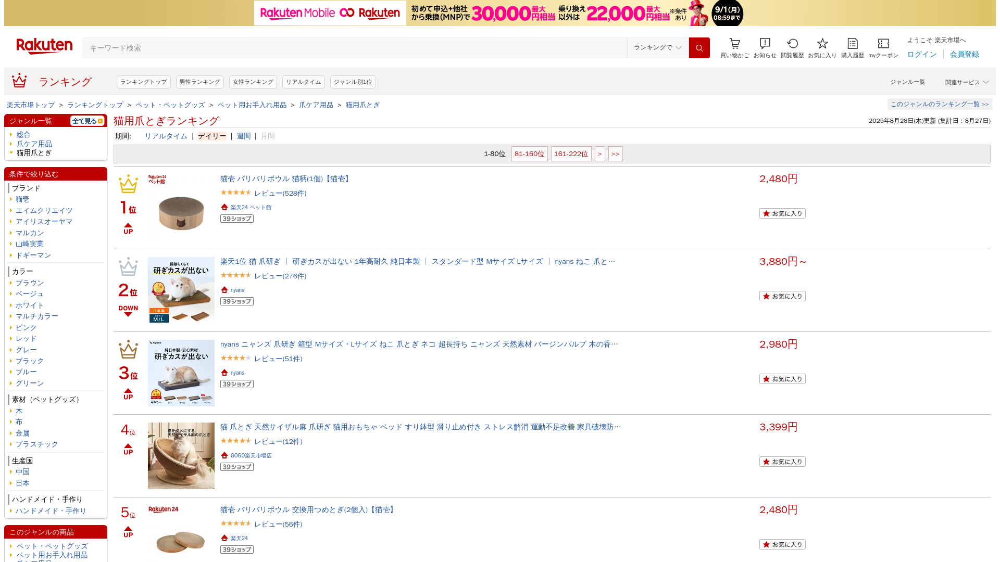
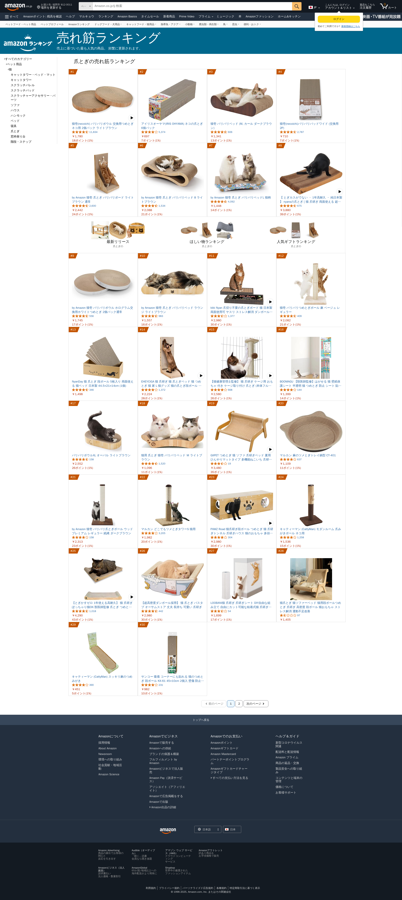

# Ranking Scraper Lambda

AWS Lambdaで動作するスクレイピングとスクリーンショット取得、Google Driveへのアップロードの機能を実装しています。
楽天とAmazonのランキングページをスクレイピングし、指定した条件の商品が1位の時にスクリーンショットを撮影してGoogle Driveに保存します。

## 目的

楽天、Amazonそれぞれのプラットフォームで指定した商品が1位の時の、スクリーンショットが必要だったため。


## 📸 スクリーンショット


### 🛍️ 楽天

条件例: nyanzaqストアの「バリバリボウル」が1位の時

<div align="center">
  
</div>

### 🛒 Amazon

<div align="center">
  
</div>

## 機能

- 楽天市場とAmazonの特定カテゴリのランキングページをスクレイピング
- Puppeteerを使用した高品質なスクリーンショット取得
- ページのHTMLコンテンツの保存
- Google Driveへのファイルアップロード
- AWS Lambda上での実行
- Serverlessフレームワークを用いたデプロイ

## 必要条件

- Node.js 22.x
- AWS アカウント
- Google アカウント（Google Drive APIの有効化と認証情報の準備）
- Serverlessフレームワーク（デプロイ用）

## インストール方法

1. リポジトリをクローン
```bash
git clone <リポジトリURL>
cd ranking-scraper-lambda
```

2. 依存関係をインストール
```bash
npm install
```

3. 環境変数の設定
`.env.example`ファイルを`.env`にコピーして、必要な値を設定します。
```bash
cp .env.example .env
```

4. Google認証情報の設定
```
# 以下のいずれかの方法で設定
# A. 環境変数に直接JSONを設定
GOOGLE_CREDENTIALS_JSON={"type":"service_account", ...}

# B. ファイルに保存
# google-credentials.jsonファイルをプロジェクトのルートに保存し、以下を設定
GOOGLE_APPLICATION_CREDENTIALS=./google-credentials.json
```

### スクリーンショットの保存条件

.envに設定します

```bash
RAKUTEN_URL=''
AMAZON_URL=''
KEYWORD=''
STORE_CODE=''
```

#### 🛍️ 楽天の条件

以下の両方を満たす場合に保存：
1. ✅ 商品URLに/{storeCode}/が含まれる（例：/nyanzaq/）
2. ✅ 商品タイトルにkeywordが含まれる（例：「バリバリボウル」）

#### 🛒 Amazonの条件

以下を満たす場合に保存：
1. ✅ 商品タイトルにkeywordが含まれる（例：「バリバリボウル」）

※ AmazonはstoreCodeのチェックをしません（urlConditionが常にtrue）

```
# 例
- 楽天: nyanzaqストアの「バリバリボウル」が1位の時のみ保存
- Amazon: 「バリバリボウル」が1位の時は常に保存
```

## Docker環境での実行方法（推奨）

Docker環境を使用すると、環境依存の問題を解決し、本番環境に近い状態でテストできます。

### 前提条件
- Docker
- Docker Compose
- Docker BuildKit（キャッシュ機能活用のため）

### BuildKitの有効化
Docker BuildKitを有効化すると、ビルド速度が向上します。

```bash
# 環境変数で設定
export DOCKER_BUILDKIT=1
export COMPOSE_DOCKER_CLI_BUILD=1

# または~/.bashrcなどに追加
echo "export DOCKER_BUILDKIT=1" >> ~/.bashrc
echo "export COMPOSE_DOCKER_CLI_BUILD=1" >> ~/.bashrc
```

### 使い方

1. Dockerコンテナをビルド
```bash
make build
# または
docker-compose build
```

2. アプリケーションを実行
```bash
make run
# または
docker-compose up
```

3. バックグラウンドで実行する場合
```bash
make run-bg
# または
docker-compose up -d

# 起動したら、シェルにアクセス
make shell
# または
docker-compose exec app bash
```

4. ログを確認する場合
```bash
make logs
# または
docker-compose logs -f
```

5. コンテナを停止する場合
```bash
make stop
# または
docker-compose down
```

Makefileを使用すると、よく使われるコマンドを簡単に実行できます。

## デプロイ方法

### 事前準備
- S3にバケットを作成し serverless.ymlに記載
- IAM Userを作成しpackage.jsonのdeployのprofileに記載
- 作成したIAMに以下の権限を付与

```
AmazonEventBridgeFullAccess
AmazonS3FullAccess
AWSCloudFormationFullAccess
AWSLambda_FullAccess
CloudWatchLogsFullAccess
IAMFullAccess
```

Serverlessフレームワークを使用してAWS Lambdaにデプロイします。

```bash
# 環境変数を設定
export GOOGLE_DRIVE_SCREENSHOT_FOLDER_ID=<フォルダID>
export GOOGLE_DRIVE_HTML_FOLDER_ID=<フォルダID>
export GOOGLE_CREDENTIALS_JSON=<認証情報JSON>

# デプロイ
npm run deploy
```

## Chromiumの設定

このプロジェクトは`@sparticuz/chromium`を使用しており、Lambda関数でもChromiumを簡単に実行できます。

- 依存パッケージに`@sparticuz/chromium`を含めているため、別途Lambda Layerは不要です
- `serverless deploy`コマンドでデプロイする際、自動的に必要なファイルがパッケージに含まれます
- ローカル開発環境ではシステムにインストールされたChromiumを使用します（MacやLinuxでは`brew install chromium`などでインストール）

## 注意点

- AWS Lambdaの実行時間は最大15分です。スクレイピング対象が大きい場合は注意してください。
- Lambda関数のメモリサイズを適切に設定してください（2048MB以上を推奨）。
- Google Drive APIの使用量制限に注意してください。

## トラブルシューティング

- エラー時には、エラー情報とスクリーンショットが自動的にGoogle Driveに保存されます。
- CloudWatchのログでエラー詳細を確認できます。
- デバッグを有効にする場合は、`DEBUG=true`を設定してください。
